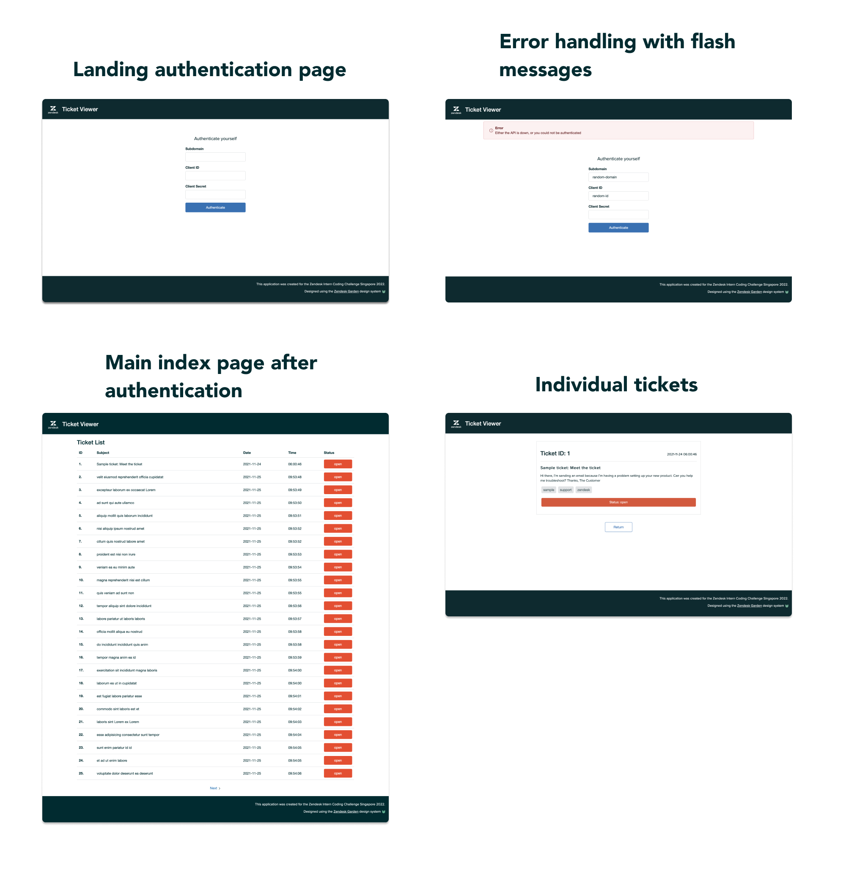

# Ticket-Viewer

<div id="top"></div>

<!-- TABLE OF CONTENTS -->
<details>
  <summary>Table of Contents</summary>
  <ol>
    <li>
      <a href="#about-the-project">About The Project</a>
    </li>
    <li>
      <a href="#getting-started">Getting Started</a>
      <ul>
        <li><a href="#prerequisites">Prerequisites</a></li>
        <li><a href="#installation">Installation</a></li>
        <li><a href="#usage">Usage</a></li>
        <li><a href="#unit-testing">Unit Testing</a></li>
      </ul>
    </li>
    <li><a href="#challenge-requirements">Challenge Requirements</a></li>
    <li><a href="#screenshots">Screenshots</a></li>
    <li><a href="#contact">Contact</a></li>
  </ol>
</details>


<!-- ABOUT THE PROJECT -->
## About The Project

A ticket viewer web application built for the Zendesk Coding Challenge 2022, Singapore. Built with the [Flask](https://flask.palletsprojects.com/en/2.0.x/) framework and designed using the [Zendesk Garden](https://garden.zendesk.com) design system. Application is in the app folder.

### Python files
- app.py is where the main code lives
- api_auth.py contains all authentication related functions
- ticket_handler.py contains all ticket related functions
- forms.py contains all WTForms
- constants.py contains all constants
- unit_test.py contains all unit tests, which are to be run

### Folders
- mocks folder contains all mocks for unit testing
- static folder contains all CSS and assets (svgs, fonts etc.)
- templates folder contains all HTML files to be routed to


<!-- GETTING STARTED -->
## Getting Started

### Prerequisites

- Python 3
- Git

### Installation

1. Clone the repository
  ```
  $ git clone https://github.com/limjunan/Ticket-Viewer.git
  ```
2. Navigate to the Ticket-Viewer directory
  ```
  $ cd Ticket-Viewer
  ```
3. Install external libraries in requirements.txt
  ```
  $ pip3 install -r requirements.txt
  ```

### Usage

1. Run the application on your local machine
  ```
  $ python3 app/app.py
  ```
2. Open up http://127.0.0.1:5000/ in your browser (or as specified in the output)

3. Client ID and Secret are your OAUTH credentials

### Unit Testing

1. Navigate to the app folder
  ```
  $ cd app
  ```
2. Run unit_tests.py (sample output below)
  ```
  $ python3 unit_tests.py
  Your subdomain: zcclimjunan
  ........
  ----------------------------------------------------------------------
  Ran 8 tests in 0.010s

  OK
  ```


<!-- Screenshots -->
## Screenshots




<!-- Requirements -->
## Challenge Requirements

- [x] Connect to the Zendesk API
- [x] Request all the tickets for your account
- [x] Display them in a list
- [x] Display individual ticket details
- [x] Page through tickets when more than 25 are returned
- [x] Include a README with installation and usage instructions
- [x] Includes tests


<!-- CONTACT -->
## Contact

Bryan Lim - [LinkedIn](https://www.linkedin.com/in/lim-jun-an-bryan-068bba185/) - bryanlim080302@gmail.com

Project Link: [https://github.com/limjunan/Ticket-Viewer](https://github.com/limjunan/Ticket-Viewer)

🙀

<p align="right">(<a href="#top">back to top</a>)</p>
